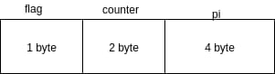
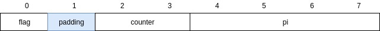
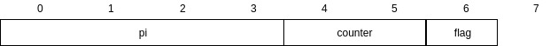

Bài này nói về struct type rất thú vị, với mình nó hầu hết là kiến thức mới.

Mình sẽ bắt đầu với 1 ví dụ về  struct trong golang:

```go
type example struct {
    flag bool
    counter int16
    pi float32
}

func main(){
    var e1 example
}
```

Nhìn vào struct trên, khi khai báo  e1, bạn nghĩ nó sẽ **chiếm** bao nhiêu byte.
Mình thử phân tích nhẹ nhé:
struct gồm 3 trường là 
```
1. flag kiểu bool -> 1 byte
2. counter kiểu int16 -> 2 byte     
3. pi kiểu  float32 -> 4 byte
```


Vậy 1 + 2 + 4 = 7 byte, quá là hợp lý luôn :D. Mình cũng tính vậy, nhưng thực tế lại không phải. Chính xác là 8 byte. Vậy lý do  ở đây là gì? Để trả lời câu hỏi này mình sẽ ghi lại để nhớ về khái niệm **Data structure alignment & padding**. (sau khi xem bài học mình có đọc thêm phần này trên daynhauhoc.com trích lại phần địch nghĩa ở đây).

**Data structure alignment** theo Wikipedia: Data Structure is the way data is arranged and accessed in computer memory - *Khi data load lên memory sẽ được CPU sắp xếp lại để tiện cho việc truy xuất tối ưu nhất có thể. Các CPU hiện đại luôn thao tác trên memory theo từng khối ở địa chỉ là một số chẵn, không theo tác trên địa chỉ là số lẻ.* Vậy ta sẽ có thêm 2 khái niệm sau:

* **Data alignment**: sắp xếp data sao cho địa chỉ của cá biến luôn là số chẵn và phù hợp với hệ thống.
* **Data padding**: để làm  được việc alignment như ở trên chúng ta cần phải "padding" thêm một số byte vào sau biến để biến tiếp theo có địa chỉ chẵn.

Trên các hệ thông khác nhau, chúng ta sẽ có sự khác nhau giữa size của các data type khác nhau, trong bài này mình chỉ để cập trên hệ thống 64bit với 8-byte align.

Vậy trong hệ thống 64bit struct example sẽ chiếm bao nhiêu byte.



Giả sử struct trên sẽ được bắt đầu thừ ô nhớ 0, flag chiếm 1 byte, để counter bắt đầu từ ô nhỡ chẵn, ô nhớ 1 sẽ được tính là padding. counter 2 byte, pi bắt đầu từ ô nhớ 4, không cần thêm padding.
Vậy sizeof e1 sẽ bằng 8 byte.

### Tối ưu sizeof struct

Chúng ta có thể sắp sếp lại thứ tự các field theo size của filed từ lớn đến nhỏ, ví dụ: 



Như vậy sizeof e1 sẽ là 7 byte (sau khi tối ưu padding)

[tham khảo thêm về Data structure alignment](https://daynhauhoc.com/t/chia-se-data-structure-alignment-padding/1123)